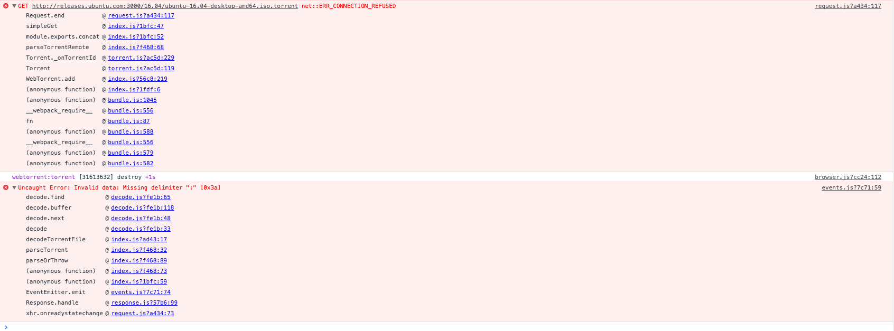

# README

## Reproducing the problem

### Install/Start the Server

```bash
npm install
npm start
```

### [Open the local page](http://localhost:3000)

### Open up the console

As you can see in [index.js](./src/index.js), I am adding the torrent without :3000, but as demonstrated in your console and my screenshot, :3000 is appended to the url of the torrent as part of the error message.


